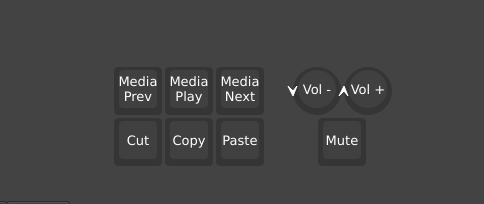

# mp321-mpみつい

## 概要
mp321は、コンパクトな左手デバイスです。名刺サイズの基板に６つのキーとロータリーエンコーダーが搭載されています。
vialを使用してキー割り当てを自由に変更できます。

## 準備物
- mp321本体
- USBケーブル(AtoCまたはCtoC)
注意点：USBケーブルは通信ができるものを使用してください。100均等で「充電専用」として販売されているものは使用出来ません。

## キー割り当ての変更
本機のキー割り当ては「[vial](https://get.vial.today)」というソフトウェアを使用することで変更できます。
vialにはwebブラウザ版とアプリケーション版があり、ブラウザ版はChrome、アプリ版はWindows,macOS,Linuxで動作します。
また、2025/10/21時点で、vialは日本語対応していません。ご注意ください。

ここでは、vialを使用するとできることについて簡単に説明します。(詳細な操作方法等についてはネットで検索するか、後述の参考記事をご覧ください)
1. キーマップの変更
   - キーに割り当てられた機能を自由に変更できます。
   - キーボードに実際にあるキーだけでなく、メディアキー(音楽の再生/停止など)や、特殊キー(画面の明るさ調整など)も割り当て可能です。
   - 複数のキーを同時に押すショートカット(例: Ctrl+C)も一つのキーに割り当てられます。
2. マクロの設定
   - 複数のキー操作を一つのキーにまとめて割り当てることができます。
   - 例えば、「Ctrl+Aで全選択したあとに、Ctrl+Cでコピーする」といった連続した動作を一つのキーに設定することが可能です。
   - テキストの入力(「Hello, World!」と入力するなど)もマクロに含めることができます。
3. レイヤー機能
   - 複数のキーマップを作成し、特定のキーを押すことでキーマップを切り替えることができます。
   - 例えば、通常のキーマップと、ゲーム用のキーマップを切り替えることが可能です。
4. コンボキー
   - 複数のキーを同時に押すことで、別の機能を発動させることができます。
   - 例えば、AキーとBキーを同時に押すとCキーの機能が発動するように設定できます。
5. タップダンス
   - キーの押し方(単押し、長押し、単押し2回、単押しした直後に長押し)によって、異なる機能を割り当てることができます。
   - 例えば、普通にAキーを押すとAキーの機能が発動し、長押しするとBキーの機能が発動するように設定できます。

## 参考記事
vialの詳細な使用方法については、こちらの記事がおすすめです。
- [【初心者向け】Vialでキーボードをカスタムしよう！](https://alektor.hatenablog.com/entry/2024/11/15/233435)
- [（初心者編）Vialを使ってキーマップを書き換えよう-自作キーボード温泉街の歩き方](https://salicylic-acid3.hatenablog.com/entry/vial-manual)

## デフォルトキーマップ
mp321は初期状態では次のようなキー設定となっています。

mp321についているノブ(ロータリーエンコーダー)は、vial上では右回転と左回転、押し込みがそれぞれ分かれて表示されています。
